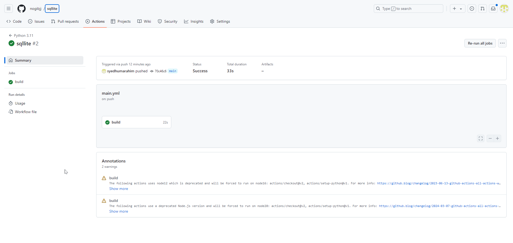

[](https://github.com/nogibjj/sqllite/actions/workflows/main.yml)

# Interacting with SQL Database using Python Script

This is the sixth Assignment for Data Engineering on Interacting with SQL Database.

# Medical Records CRUD Operations with SQLite

This project demonstrates how to perform basic CRUD (Create, Read, Update, Delete) operations on a SQLite database using a Python application. The dataset used contains medical records with fields such as patient ID, name, date of birth, gender, medical conditions, medications, allergies, and last appointment date.

## Project Structure

```
├── .devcontainer/            # DevContainer setup files
├── .github/                  # GitHub Actions CI/CD workflows
├── data/                     # Contains the CSV data files used to load into the SQLite database
│   └── medical_records.csv    # Medical records CSV file
├── helper/                   # Helper scripts (like utility functions to perform SQL operations)
├── CRUD_functions.py          # CRUD operations for database
├── .gitignore                # Git ignore file
├── Makefile                  # Makefile to automate setup, linting, formatting, and testing
├── README.md                 # Project documentation
├── main.py                   # Main Python file that contains the CRUD operations
├── medical_records_DB.db      # The SQLite database file
├── requirements.txt          # Python package dependencies
├── test_main.py              # Unit tests for the CRUD operations
```


## Features

- **CRUD Operations**: Create, Read, Update, and Delete medical records in the SQLite database.
- **SQLite Integration**: Uses SQLite as the database engine to store and manage medical records.
- **CI/CD Pipeline**: Includes a GitHub Actions CI/CD workflow for testing and validating the code.
- **Database Loading**: The project includes functionality to load medical records from a CSV file into the database.


## Setup and Installation

### 1. Clone the Repository

```
git clone https://github.com/your-username/medical-records-crud.git
cd medical-records-crud
```

### 2. Install Dependencies
Install the required Python packages using pip:

```
make install
```

This will:
Upgrade pip and install all dependencies listed in requirements.txt.

### 3. Load the SQLite Database

To load the medical records from the data/medical_records.csv into the SQLite database, run:
```
make load_db
```

This will create and populate the medical_records_DB.db file.

## Database Table: `medical_records`

The SQLite database contains a single table called `medical_records`, which stores the details of patients' medical records. Below is the structure of the table along with explanations for each field.

### Table Structure:

| Column Name              | Data Type | Description                                                |
|--------------------------|-----------|------------------------------------------------------------|
| `patient_id`              | INTEGER   | A unique identifier for each patient.                      |
| `name`                    | TEXT      | The full name of the patient.                              |
| `date_of_birth`           | TEXT      | The patient's date of birth in `YYYY-MM-DD` format.        |
| `gender`                  | TEXT      | The gender of the patient (`M` for Male, `F` for Female).   |
| `medical_conditions`      | TEXT      | A comma-separated list of the patient's medical conditions. |
| `medications`             | TEXT      | A comma-separated list of medications the patient is taking.|
| `allergies`               | TEXT      | A comma-separated list of the patient's known allergies.    |
| `last_appointment_date`   | TEXT      | The date of the patient's most recent appointment.          |

### Example Record:

| `patient_id` | `name`         | `date_of_birth` | `gender` | `medical_conditions`          | `medications`         | `allergies`        | `last_appointment_date` |
|--------------|----------------|-----------------|----------|-------------------------------|-----------------------|--------------------|-------------------------|
| 1            | Scott Webb     | 1967-04-28      | F        | Mrs, story, security           | example, parent, city  | each, product, two | 2022-07-26              |

### Field Descriptions:

- **`patient_id`**: This is a unique identifier for each patient in the database. It is an `INTEGER` value and serves as the primary key for the table.
  
- **`name`**: The full name of the patient stored as a `TEXT` value.

- **`date_of_birth`**: The patient's date of birth, formatted as `YYYY-MM-DD`. It is a `TEXT` value to accommodate different date formats.

- **`gender`**: The gender of the patient, stored as `TEXT`. Typically, the values will be either 'M' (Male) or 'F' (Female).

- **`medical_conditions`**: A comma-separated list of medical conditions the patient has. It is a `TEXT` value, allowing the system to store multiple conditions in one field.

- **`medications`**: A comma-separated list of medications the patient is taking, stored as `TEXT`.

- **`allergies`**: A comma-separated list of known allergies, stored as `TEXT`.

- **`last_appointment_date`**: The date of the patient's most recent appointment, formatted as `YYYY-MM-DD`, stored as `TEXT`.

### Example Queries:
You can run the following SQL queries to interact with the `medical_records` table:

- **fetching patients with asthma**:

  ```SELECT * FROM medical_records WHERE medical_conditions LIKE '%asthma%';```


# CI/CD Pipeline with GitHub Actions



To maintain code quality and streamline development, I have set up a CI/CD pipeline using GitHub Actions. Here's how it enhances the project:

- **Automated Testing**:
  - Every push triggers tests using **pytest**, ensuring new changes don't break existing functionality.

- **Code Formatting and Linting**:
  - **Python Black** formats the code consistently.
  - **Ruff** lints the code to catch errors and enforce coding standards.

- **Dependency Management**:
  - Dependencies are installed via a pinned `requirements.txt` to ensure consistent environments across different setups.

- **Continuous Integration Badges**:
  - The README includes badges that display the status of the pipeline steps, providing immediate feedback on the codebase's health.

This automated workflow not only saves time but also ensures that the project remains robust, maintainable, and scalable.


